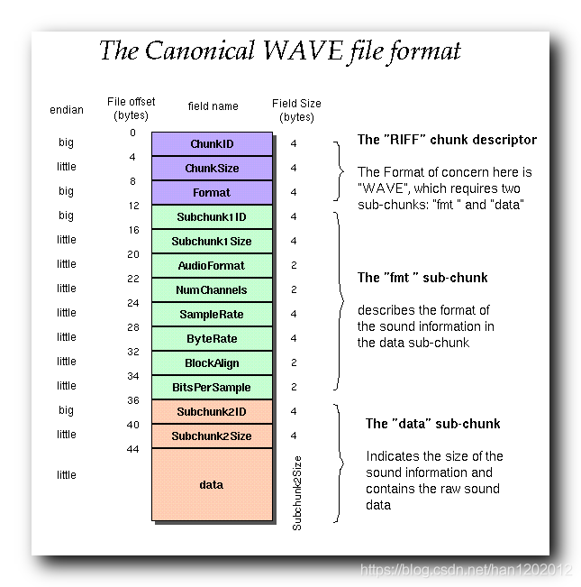
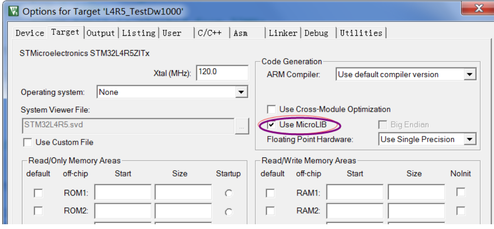

#2022-7-22
------------
1. wavplay.c/h 中 增加一个变量(current_data_ptr)在结构体 wavx中
2. 考虑到按键声音是短播放时间，而切割提示音为长播放时间（可能一个数据段循环播放），所以还需要增加如下变量：
  a. 增加一个判定是否为循环播放的变量（bool loop_sound_flag;）在结构体 wavx中。
  b. 增加一个声音数据是否有效的变量 （bool actived_flag;）
3. 变更wav_decode_init的调用参数 uint8_t wav_decode_init(ENUM_WAVE_TYPES wav_type)
4. 完成wav_decode_init() 函数
5. 尝试修正：uint32_t wav_buffill(uint8_t *buf,uint16_t size,uint8_t bits) 函数
6. 在修正上面函数时，要考虑循环数据的衔接问题！还有按键声音等短时间提示音的终止问题
7. 24bit时，实际存储上每3个字节为一个数据，写到缓冲区时，需要写入4字节（最高字节的数据是无效的）而且需要处理数据不够一个缓冲区时的问题！！！这时要考虑是否为循环数据！！！！


#2022-7-25
1. 声音播放有两个停止模式：
   - 连续播放时，只有主动请求停止播放才可以停止
   - 非连续播放时，切换声音会停止当前的声音播放，并换到其他声音
   - 非连续播放时，当声音播放到末尾时，读取数据的函数会把数据状态切换到失效，再次读取数据将停止播放（DMA传送）
2. uint16_t wav_buffill(uint8_t *buf,uint16_t size,uint8_t bits);已经完成
   24bit时，实际存储上每3个字节为一个数据，拷贝到缓冲区时，需要写入4字节（其中最高字节的数据是无效的，我们默认填0），这里是3字节转4字节！而且需要处理数据不够一个缓冲区时的问题！这时要考虑是否为循环数据！
3. 开始修正 void wav_sai_dma_tx_callback(void) DMA回调函数！
   - 需要修正wav_buffill，当声音数据读取到结束时，非连续循环播放的读取操作需要设置结束标记！供DMA回调函数使用！！！
   - 回调函数负责停止非连续播放的声音
   - 增加 wavctrl.stop_buf_flag
   - 增加 结束标记的定义
```
  typedef enum 
  {
      EM_WAV_NO_END,        // 无停止数据
      EM_WAV_TWO_BUFFER_END0,// 双缓存停止在BUF0
      EM_WAV_TWO_BUFFER_END1,// 双缓存停止在BUF1
      EM_WAV_SINGLE_END
  }ENUM_WAV_STOP_BUFFER_DEFINES;
```
4. 开始修正 uint8_t wav_play_song()
5. 需要编写测试函数
6. 需要准备音乐数据---*.wav 转换成 *.c


# 2022-7-26
1. 查找音乐素材，都是收费的，而且是双声道数据，需要专门的程序转换格式和播放时间以符合实际需要。
2. 编写数据转换程序
3. 程序使用的所有声音文件都是单声道的？且最大长度不超过64K bytes
4. 为了省事，生成的文件需要手动重新修改数据长度！！！
   为 0xD0,0xFF,0x00
5. 

## 简单梳理一下WAV的文件格式


### RIFF Chunk(0x00)   文件标识块

| 名称 | 偏移地址 | 字节数 | 端序 | 内容              |
| ---- | -------- | ------ | ---- | ----------------- |
| ID   | 0x00     | 4      | 大端 | RIFF (0x52494646) |
| Size | 0x04     | 4      | 小端 | fileSize - 8      |
| Type | 0x08     | 4      | 大端 | WAVE(0x57415645)  |

### Format Chunk(0xc)   文件属性块
| 名称          | 偏移地址 | 字节数 | 端序 | 内容               |
| ------------- | -------- | ------ | ---- | ------------------ |
| ID            | 0x00     | 4Byte  | 大端 | 'fmt '(0x666D7420) |
| Size          | 0x04     | 4Byte  | 小端 | 16                 |
| AudioFormat   | 0x08     | 2Byte  | 小端 | 音频格式           |
| NumChannels   | 0x0A     | 2Byte  | 小端 | 声道数             |
| SampleRate    | 0x0C     | 4Byte  | 小端 | 采样率             |
| ByteRate      | 0x10     | 4Byte  | 小端 | 每秒数据字节数     |
| BlockAlign    | 0x14     | 2Byte  | 小端 | 数据块对齐         |
| BitsPerSample | 0x16     | 2Byte  | 小端 | 采样位数           |


### Data Chunk(0x24)文件数据块

该区块是真正保存wav数据的地方，以'data'作为该Chunk的标示。

| 名称 | 字节  | 端序 |
| ---- | ----- | ---- | ------------------ |
| ID   | 4字节 | 大端 | 以'data'为标识     |
| Size | 4字节 | 小端 | 表示音频数据的长度 |
| Data | 可变  | 小端 | 音频数据           |


##### 后面需要做的工作

# 2022-7-27

1. SDRAM 移植完成
2. 修正SDRAM读写函数为 16bits读写缓冲区
<font color=red>I. SAI 初始化需要测试一下！！！</font>
<font color=green>II. SDRAM 初始化</font>
III. SDRAM 数据解析！！


### 不要OS！！！
1. <font color=red>需要重新规划系统</font>

# 2022-7-28
----
1. usart 中断函数处理(uart1+uart3)
2. 增加 毫秒定时器和毫秒计时变量
3. 增加 Flash测试代码
4. <font color=blue>此工程在实际测试时不能跳转到main函数，测试原点代码却可以，说明st_link驱动和设备都没有问题，可能是连线有问题！！</font>
5. 自行制作stlink到电路板的连线，发现电路板10PIN接口为非标准定义的调试接口，需要手工调整连线
6. 电路板只支持SWD调试模式！！
   - PIN 1-VCC
   - PIN 4-SWDIO
   - PIN 6-SWCLK
   - PIN 9-GND

   | ST-LINK | UCS-BOARD | NAME  |
   | ------- | --------- | ----- |
   | 1       | 1         | VCC   |
   | 7       | 4         | SWDIO |
   | 9       | 6         | SWCLK |
   | 10      | 10        | GND   |

# 2022-7-29
----  

  - 去掉 CAN 和 （先）LWIP功能，因为运行失败！！！
  - 解决无法运行到main()函数的问题,需要勾选"Use MicroLIB"选项

  - 程序跑飞了，先重置OS，如果不行，再关闭所有的硬件，一个一个地添加
  - <font color=red> 可能是RTC没有外置电源造成的问题</font>
  - 声音播放时，没有初始化WM8978 

1. US 最大控制电压 80V(控制值为2200)
2. US 最小控制电压为31.65V(控制值为3100)
3. 需要确定US控制电压和控制值是否有线性关系，再分析是以控制电压来做PID控制参考值合适还是以直接控制值做控制参考值合适！
4. 贺工的程序里频率的参考范围 54000<-55500->57000 Hz
5. 使用相位记录1500个数据，频率失调后 依照计算的失调点（计算的相位差>=50）数，是做重新扫描频率的操作，扫描分三种：
   - 初始扫描：操作开始时，是初始扫描（就是大范围扫描）以寻找谐振点！！
   - 大范围频率扫描：54000-57000范围以最小工作电压做扫描。其频率步进为200Hz，且为从低频率到高频率单向扫描，当相位记录中失调点小于等于2时，进入精确扫描精确扫描。
   - 精确扫描，精确扫描的频率范围为谐振频率(55500±200HZ)


# 2022-8-1
----

1. <font color=green>系统崩溃的问题已经解决</font>
2. <font color=green>解决程序下载代码过大的问题，因为高位1M的FLASH固定为音乐代码，所以，可以考虑只下载低位1M的内容。</font>
3. 先调试UART供测试！！！ 测试完成！！！
4. FLASH2 测试有问题！！！
5. SDRAM　测试有问题！！！
6. <font color=red>经过验证，是使用SRAM接口！！！</font>
7. 

# 2022-8-2
----
<font color=green></font>
<font color=red></font>
1. <font color=red>SRAM地址线未定义！！。</font><font color=green>已经解决！！</font>
2. 开始调试声音！！！
3. 声音出来了，但声音不对

# 2022-8-3
-----
1. 尝试使用完全的示例代码环境
  - [] TODO: 使用OLD代码中的声音数据
  - [] TODO: 完整复制声音播放代码！！
  - [x] TODO: 开始处理单声道数据
  - [] TODO: 似乎单声道数据还是没能处理，尝试把单声道数据变成双声道数据！
  - [x] 去掉系统生成的SAI模块，使用例程中的数据
       - 需要修正文件 stm32f4xx_hal_conf.h
         
         #define HAL_SAI_MODULE_ENABLED
       - 并添加SAI相关驱动代码

2. HSE后面主时钟分频系数修正为示例状态
   （360 25 2 8）
3. 比较WAV文件头数据，没有问题
4. 比较play_wav 设置DMA之前的REG内容
5. 这是当前版本的 
   
   
6. 这是例程版本的
   
    

    可看到 AFRCR和ASLOTR存在差异
    

    明天研读参考手册
     hsai_BlockA1.Init.ClockStrobing 需要修改一下？？？

# 2022-8-4
----

1. 修改SAI时钟分频
2. 需要允许SAI重设PULLx（SAI PULL）以适应不同频率的音频数据
3. SAI缓冲区需用直接定义，不可以使用指定内存地址！
4. SAI缓冲区传送时，需要显式的制定地址（显式使用&）
5. SAI缓冲区不足时必须补0。
6. 目前已经发出声音！！

# 2022-8-5
----

- [x] TODO: 调节音量！！！
- [ ] TODO: 声音调度测试！ 配合脚踏板！！！
- [ ] TODO: UC 频率输出！！
- [ ] TODO: UC 功率输出  